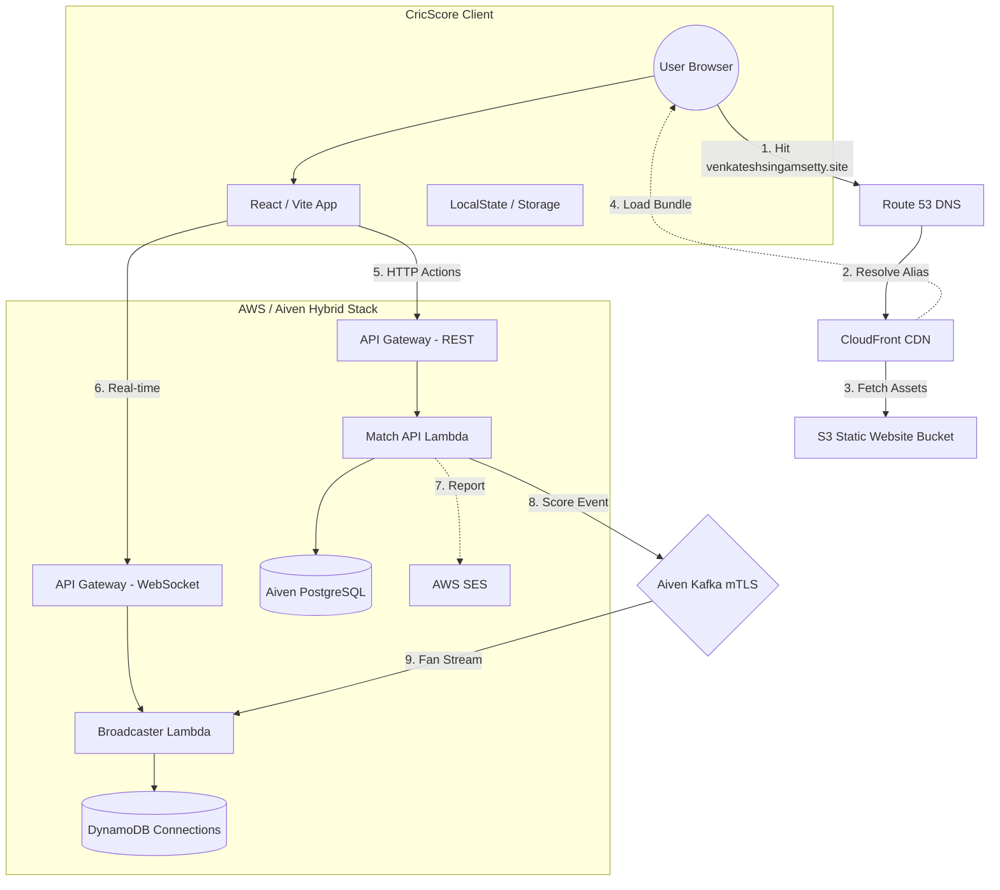

# 🏏 CricScore: Real-Time Cricket Match Engine
### 🏆 Aiven Free Tier Competition Entry (#AivenFreeTier)

[](https://aiven.io)
[](https://aws.amazon.com)
[](https://kafka.apache.org)

CricScore is a highly performant, serverless cricket engine designed for sub-second match updates. It leverages **Aiven PostgreSQL** for persistence, **Aiven Kafka** for event streaming, and **AWS Lambdas/WebSockets** for global real-time broadcasting.

---

## 🏆 Why Aiven? (A Competition Journey)
This project was built to solve the "Live Score Lag" problem using **100% Open Source and Free Tier services**. By combining **Aiven for PostgreSQL** and **Aiven for Apache Kafka**, we've achieved a true **Event-Driven Architecture (EDA)** that stays within free-tier limits while providing enterprise-grade features:

- **Dual-Write Integrity:** We use Aiven PG as our "Master of Record" for historical ball events and Aiven Kafka as our "Fast-Path Stream" for sub-second spectator updates.
- **mTLS Security (Hardened Hands-on):** Unlike many simple demos, CricScore implements full **Mutual TLS (mTLS)** for all Kafka communication. We securely inject client certificates as Base64 environment variables into our serverless functions.
- **Zero-Latency Broadcast:** By triggering AWS Lambdas directly from Aiven Kafka events, we bypass traditional polling and deliver live scores to thousands of fans instantly.

📖 **[Read Our Full Aiven Journey Story (#AivenFreeTier)](./docs/aiven_journey.md)**

---

---

## ⚡ Quick Start (Production)
- **Live Site**: [https://venkateshsingamsetty.site](https://venkateshsingamsetty.site)
- **HTTP API**: `https://mmiwp8rgrf.execute-api.us-east-1.amazonaws.com`
- **WebSocket**: `wss://i4cnmjy0tg.execute-api.us-east-1.amazonaws.com/prod`

---

## 🏗️ Technical Portal
Detailed engineering docs can be found in the **[`docs/`](./docs)** folder:

- **[Architectural Flows](./docs/architecture_diagrams.md)**: Mermaid diagrams for score updates, emails, and data hydration.
- **[System Overview](./docs/architecture.md)**: High-level Event-Driven Architecture (EDA) & Component breakdown.
- **[API Guide](./docs/api.md)**: REST & WebSocket contract specifications.
- **[Full Project Log](./docs/changelog.md)**: Complete project history and v1.2.0 release notes.
- **[Infrastructure Stack](./docs/infrastructure.md)**: Aiven & AWS service configurations.
- **[Cost & Performance](./docs/cost_management.md)**: Free-tier monitoring and optimization strategy.

---

## 🌐 Web Traffic & Infrastructure Journey
This diagram illustrates the request flow from the moment a user hits **https://venkateshsingamsetty.site** until the **CricScore** application is running in their browser.



---

## 🚀 Cloning & Custom Deployment

To run CricScore under your own **Aiven** and **AWS** accounts, you must update the following four areas:

### 1. **Infrastructure Variables (`terraform.tfvars`)**
Navigate to `terraform/` and create a `terraform.tfvars` file. This is where the backend connects to your data services:
```hcl
# Aiven PostgreSQL URL
database_url            = "postgres://avns_admin:..."

# Aiven Kafka Connectivity (mTLS)
kafka_bootstrap_servers = ["p-1.aivencloud.com:17729"]

# Base64-Encoded mTLS Certs (openssl base64 -A -in cert.pem)
kafka_ca_cert           = "..."
kafka_access_cert       = "..."
kafka_access_key        = "..."
```

### 2. **Frontend Endpoints (`.env`)**
After running `terraform apply`, you will receive several outputs. Use these to update your project's root `.env` file:
```env
# AWS API Gateway URLs (From Terraform Outputs)
VITE_API_URL=https://<your-api-id>.execute-api.us-east-1.amazonaws.com
VITE_WS_URL=wss://<your-api-id>.execute-api.us-east-1.amazonaws.com/prod
```

### 3. **Email Identity (AWS SES)**
If you wish to use the **Premium Reporting Engine**, you must:
1. Verify your domain in the **AWS SES Console**.
2. Update the `Source` parameter in `backend/lambdas/match-api/index.js` to your verified email address.
3. Ensure your domain's DKIM and SPF records are configured in your DNS provider (e.g., Route53).

### 4. **One-Command Deployment (`deploy.sh`)**
Ensure your **AWS CLI** is configured (`aws configure`). Then run:
```bash
# Build and sync to S3 + CloudFront invalidation
./deploy.sh
```

---

---
© 2026 CricScore Engine. Designed for the Serverless Generation.
