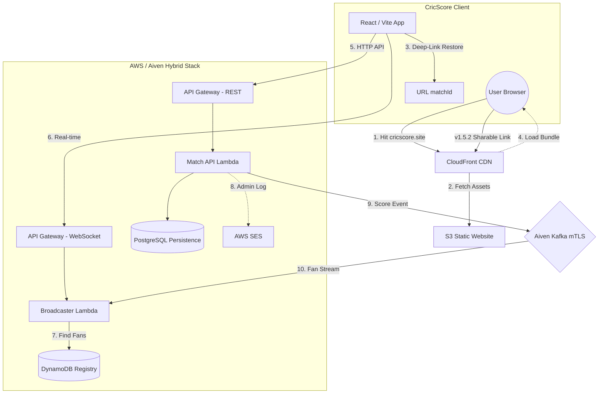

# 🏏 CricScore: Real-Time Cricket Match Engine
### 🏏 High-Performance, Event-Driven Cricket Engine

CricScore is a highly performant, serverless cricket engine designed for sub-second match updates. It leverages a hybrid-cloud event-driven stack for global real-time broadcasting.

🚀 **Live Production:** **https://cricscore.venkateshsingamsetty.site**

---

## 🗄️ Aiven Managed Services: Event Streaming & Persistence
CricScore utilizes the **Aiven Lifecycle Management** platform to provide professional-grade, high-availability data integrity:

- **Aiven for PostgreSQL**: The **System of Record** for all historical match data, innings, and ball-by-ball archives.
- **Aiven for Apache Kafka**: The **Real-Time Backbone** providing sub-second propagation of match events to the global fan hub.
- **Mutual TLS (mTLS)**: Hardened, certificate-based encryption for all Kafka traffic using serverless certificate injection.

📖 **[Detailed Aiven Service Breakdown & Setup](./docs/aiven.md)**

---

## 🌐 Web Traffic & Infrastructure Journey
This diagram illustrates the request flow from the moment a user hits **https://cricscore.venkateshsingamsetty.site** until the **CricScore** application is running in their browser.

---

## ⚡ Getting Started
- **Local Developer Preview**: Run the frontend locally (Requires **Node.js 18.x+**).
    - **Step 1:** `npm install`
    - **Step 2:** `cp .env.example .env`
    - **Step 3:** `npm run dev`
- **Full Deployment Guide:** **🚀 [How to Clone and Deploy Your Own Infrastructure](./docs/deployment.md)**

---

## 👥 Platform Access Roles
- **Viewer 🌍**: Single-click access to global match discovery and real-time spectator hub (Public/No Auth).
- **Scorer 🎮**: Secure multi-tenant isolation for official ball-by-ball match scoring (Secure/Email Auth).
- **Admin ⚡**: Enterprise-grade persistence governance and match record purging (Protected/Admin PIN).

---

## 🏗️ System Architecture & Technical Portal
CricScore implements a high-performance **Event-Driven Architecture (EDA)** using 100% serverless and managed services.

### 📖 Technical Guides & Documentation
- **[Full Deployment & Infrastructure](./docs/deployment.md)**: Local preview, bootstrap foundations, and AWS/Aiven Setup.
- **[Aiven Managed Services](./docs/aiven.md)**: PostgreSQL & Kafka mTLS configuration.
- **[Detailed Architecture](./docs/architecture.md)**: System design, sequence flows, and EDA logic.
- **[API Guide](./docs/api.md)**: REST & WebSocket contract specifications.
- **[Cost & Performance](./docs/cost_management.md)**: Aiven & AWS Free-tier monitoring strategy.
- **[Full Project Log](./docs/changelog.md)**: Release records and development timeline.
- **[Troubleshooting](./docs/troubleshooting.md)**: Setup fixes and identity verification help.

---
© 2026 CricScore Engine. Designed for the Serverless Generation.
