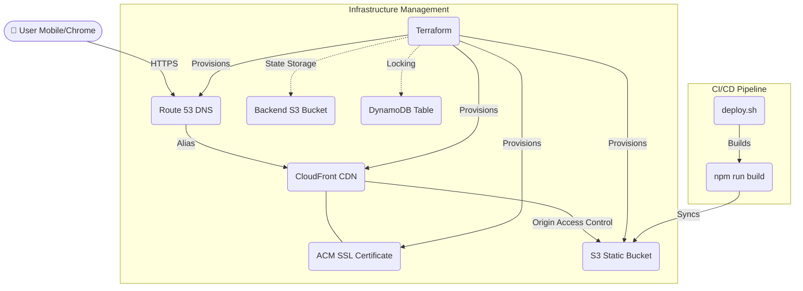

# 🏏 CricScore

CricScore is a modern, high-performance cricket scoring application designed for real-time match tracking. Built with **React 19**, **Vite**, and **Tailwind CSS**.

---

## 🏛️ Architecture

The application uses a serverless, highly available, and cost-optimized architecture on AWS:



---

## 🏁 Getting Started (Zero to Hero)

Follow these steps to set up the app on a **brand new** laptop (Mac, Windows, or Linux).

### 1. Install Prerequisites
You need the following tools installed and available in your terminal:
- **Git**: [Download Git](https://git-scm.com/downloads)
- **Node.js (v18+)**: [Download Node.js](https://nodejs.org/)
- **Terraform (v1.0+)**: [Download Terraform](https://developer.hashicorp.com/terraform/downloads)
- **AWS CLI (v2.0+)**: [Download AWS CLI](https://aws.amazon.com/cli/)

### 2. Verify Your Environment
Clone the repository and run the automated check script:

```bash
# Clone the repo
git clone https://github.com/yourusername/cric-score.git
cd cric-score

# Mac / Linux
chmod +x scripts/setup.sh && ./scripts/setup.sh

# Windows (PowerShell)
.\scripts\setup.ps1
```

### 3. Local Development
To run the application locally on your machine for development and testing:

```bash
# Install all required dependencies
npm install

# Start the Vite development server
npm run dev
```

The app will be available locally at `http://localhost:5173`. Any changes to the codebase will hot-reload automatically.

---

## 🚀 Setup & Deployment

### Step 1: AWS Configuration
Open your terminal and run the following to link your AWS account:
```bash
aws configure
```
Enter your `AWS Access Key ID`, `Secret Access Key`, and preferred region (e.g., `us-east-1`).

### Step 2: Infrastructure Configuration
Navigate to the `terraform/` directory and update `terraform.tfvars`:

```hcl
# Important: Ensure these resources exist in your AWS account first
zone_domain      = "yourdomain.com"      # Your Route53 Hosted Zone
domain_name      = "score.yourdomain.com" # The final URL you want
subdomain_prefix = "score"                # Subdomain only

# Remote State (Recommended for teams)
backend_bucket         = "your-state-bucket"
backend_dynamodb_table = "your-lock-table"
```

### Step 3: Deployment & Updates
The **easiest** way is to use the unified script from the **project root**:
```bash
# MUST be run from the root directory
chmod +x deploy.sh
./deploy.sh
```

> [!NOTE]
> If you choose to run commands manually, **Terraform commands must be executed within the `terraform/` folder**, while **npm commands must be run from the root**.

**What this script does:**
1.  **Builds** the React production bundle (`dist/`).
2.  **Initializes** Terraform and syncs your remote state.
3.  **Provisions** all AWS resources (S3, CloudFront, Route53).
4.  **Syncs** your built files to the S3 bucket.
5.  **Invalidates** the CloudFront cache to go live instantly.

---

## 🐛 Recent Bug Fixes & Core Improvements
- **Run Out Scoring Resolution**: The app now intercepts Run Out dismissals to actively prompt the umpire for any runs successfully completed before the wicket. It seamlessly computes run allocation and strike rotation prior to assigning the wicket to the appropriately specified batter (Striker or Non-Striker).
- **Accurate Extras Accounting**: Patched a mathematical bug where runs associated with boundary Wides or Byes were unintentionally zeroed out in the timeline (`W+2`, `4B`, etc. now display uniquely). The Scoreboard's "Extras Breakdown" has also been entirely overhauled to actively compute and display the complete run values for Wides, No-Balls, Byes, and Leg Byes rather than just tallying the deliveries.
- **Synchronous State Hydration (Refresh Protection)**: Resolved a critical React 18 strict-mode race condition where refreshing the browser would occasionally overwrite an active match with a blank `initialState`. The `localStorage` persistence engine now extracts data synchronously on component initialization to guarantee zero data loss.
- **Strict Modal Enforcement**: Closed loopholes in selection modals that previously allowed umpires to arbitrarily dismiss mandatory states (e.g. "Choose Next Bowler"), preventing illegal ball logging against inactive players.

---

## 💡 Key Features
- **Zero-Scroll Ergonomics**: Optimized viewport that fits the entire scoring dashboard on a single screen—no vertical scrolling required.
- **Fluid Cross-Device Scaling**: Responsive flex-containers prevent UI clipping across all devices, seamlessly fitting ultra-wide laptops to tall phones.
- **High-Density 2-Row Keypad**: An optimized 4x2 interactive keypad with massive, thumb-friendly tap targets incorporating [0-6] and [W].
- **Zero-Asset SVG Favicon**: Built-in 🏏 emoji favicon renders natively in all browser tabs without needing heavy graphical asset requests.
- **Match State Persistence**: Refresh safely; your entire match state is automatically saved to `localStorage` allowing multiple umpires to score different matches parallelly in their own browsers.
- **Live-Management Cockpit**: Fix typos mid-match by clicking player/team names, or dynamically expand your squad on the fly.
- **Precision Setup**: Free-form text area roster setup allowing you to paste in your exact batting order instantly.
- **Shareable Match Results**: Instantly generate and email a broadcast-style ASCII scorecard to anyone with a single click at the end of a match.
- **Global Reset Protection**: Safely abandon a fixture and start a new match from anywhere in the app, protected by a custom confirmation modal to prevent accidental data loss.
- **Multi-Level Undo**: Easily reverse any scoring error with deep state history tracking.

> [!TIP]
> For a complete deep-dive into every technical and functional capability, check out our **[Full Feature Documentation](features.md)**.

---

## 🛠️ Tech Stack
- **Frontend**: React 19, Vite 6, TypeScript
- **Styling**: Tailwind CSS
- **Infrastructure**: Terraform, AWS (S3, CloudFront, Route53, ACM)
- **Testing**: Vitest
