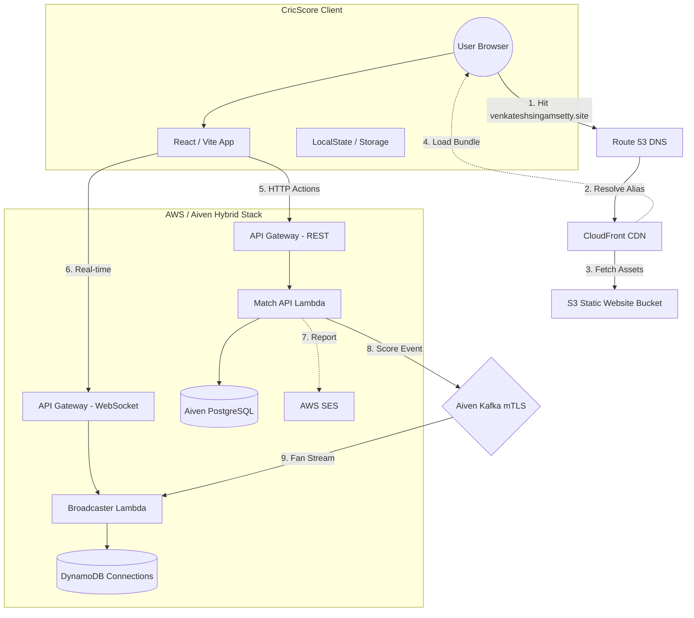

# 🏏 CricScore: Real-Time Cricket Match Engine
### 🏆 Aiven Free Tier Competition Entry (#AivenFreeTier)

CricScore is a highly performant, serverless cricket engine designed for sub-second match updates. It leverages **Aiven PostgreSQL** for persistence, **Aiven Kafka** for event streaming, and **AWS Lambdas/WebSockets** for global real-time broadcasting.

---

## 🏆 Why Aiven? (A Competition Journey)
This project was built to solve the "Live Score Lag" problem using **100% Open Source and Free Tier services**. By combining **Aiven for PostgreSQL** and **Aiven for Apache Kafka**, we've achieved a true **Event-Driven Architecture (EDA)** that stays within free-tier limits while providing enterprise-grade features:

- **Dual-Write Integrity:** We use Aiven PG as our "Master of Record" for historical ball events and Aiven Kafka as our "Fast-Path Stream" for sub-second spectator updates.
- **mTLS Security (Hardened Hands-on):** Unlike many simple demos, CricScore implements full **Mutual TLS (mTLS)** for all Kafka communication. We securely inject client certificates as Base64 environment variables into our serverless functions.
- **Zero-Latency Broadcast:** By triggering AWS Lambdas directly from Aiven Kafka events, we bypass traditional polling and deliver live scores to thousands of fans instantly.

📖 **[Read Our Full Aiven Journey Story (#AivenFreeTier)](./docs/aiven_journey.md)**

---

---

## ⚡ Getting Started
- **Live Production:** [venkateshsingamsetty.site](https://venkateshsingamsetty.site)
- **Deployment Guide:** **🚀 [How to Clone and Deploy Your Own Instance](./docs/cloning_guide.md)**

---

## 🏗️ Technical Portal
Detailed engineering docs can be found in the **[`docs/`](./docs)** folder:

- **[Architectural Flows](./docs/architecture_diagrams.md)**: Mermaid diagrams for score updates, emails, and data hydration.
- **[System Overview](./docs/architecture.md)**: High-level Event-Driven Architecture (EDA) & Component breakdown.
- **[API Guide](./docs/api.md)**: REST & WebSocket contract specifications.
- **[Full Project Log](./docs/changelog.md)**: Complete project history and v1.2.0 release notes.
- **[Infrastructure Stack](./docs/infrastructure.md)**: Aiven & AWS service configurations.
- **[Cloning Guide](./docs/cloning_guide.md)**: How to deploy your own instance.
- **[Cost & Performance](./docs/cost_management.md)**: Free-tier monitoring and optimization strategy.

---

## 🌐 Web Traffic & Infrastructure Journey
This diagram illustrates the request flow from the moment a user hits **https://venkateshsingamsetty.site** until the **CricScore** application is running in their browser.

---

## 🚀 Contribution & Development
CricScore welcomes community contributions. Please refer to the **[Cloning Guide](./docs/cloning_guide.md)** to set up your development environment.

---

---
© 2026 CricScore Engine. Designed for the Serverless Generation.
