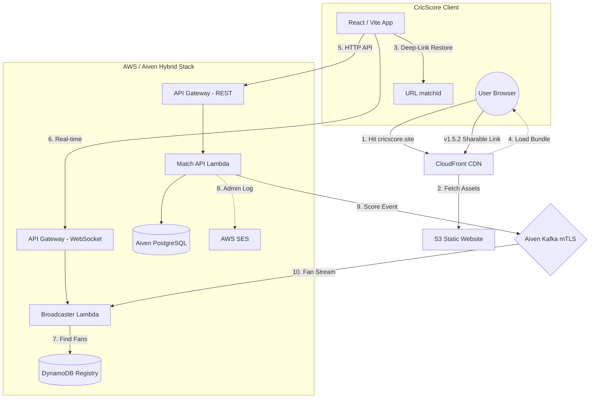

# 🏏 CricScore: Real-Time Cricket Match Engine
### 🏏 High-Performance, Event-Driven Cricket Engine

CricScore is a highly performant, serverless cricket engine designed for sub-second match updates. It leverages **Aiven PostgreSQL** for persistence, **Aiven Kafka** for event streaming, and **AWS Lambdas/WebSockets** for global real-time broadcasting.

🚀 **Live Production:** [**cricscore.site**](https://cricscore.venkateshsingamsetty.site)

---

## ⚡ Getting Started
- **Local Developer Preview**: Run the frontend locally (Requires **Node.js 18.x+**).
    - **Step 1:** `npm install`
    - **Step 2:** `cp .env.example .env`
    - **Step 3:** `npm run dev`
- **Full Deployment Guide:** **🚀 [How to Clone and Deploy Your Own Infrastructure](./docs/deployment.md)**

---

## 🌐 Web Traffic & Infrastructure Journey
This diagram illustrates the request flow from the moment a user hits **https://cricscore.venkateshsingamsetty.site** until the **CricScore** application is running in their browser.

---

## 🏗️ Technical Architecture & Managed Stack
CricScore implements a high-performance **Event-Driven Architecture (EDA)** using 100% serverless and managed services:

- **Dual-Write Integrity:** Aiven PostgreSQL for persistence + Aiven Kafka for sub-second spectator updates.
- **mTLS Security:** Encrypted mTLS authentication for all Kafka traffic using serverless certificate injection.
- **Zero-Latency Broadcast:** Sub-100ms global delivery via Aiven Kafka and AWS WebSocket Gateway.

📖 **[Detailed Architecture & Sequence Flows](./docs/architecture.md)**

---

## 🛡️ Secure Scoring & Administration
- **Viewer 🌍**: Public discovery and scoring hub (No PIN required).
- **Scorer 🎮**: Enterprise Multi-Tenant isolation (Email-restricted persistence).
- **Admin ⚡**: Global database governance and record purging (Admin PIN required).
- **v1.5.2 Sharing 🔗**: One-tap sharable match links with **Deep-Link Restoration**.

Authorization is persistent and configured via `.env` (`VITE_ADMIN_PIN`).

---

## 🏗️ Technical Portal
Detailed engineering docs can be found in the **[`docs/`](./docs)** folder:

- **[Deployment Manual](./docs/deployment.md)**: Setup, infrastructure variables, and cloud-sync guide.
- **[Bootstrap Infrastructure](./docs/bootstrap_infra.md)**: Long-lived assets (State, Locking, DNS).
- **[Detailed Architecture](./docs/architecture.md)**: System design, sequence flows, and EDA logic.
- **[API Guide](./docs/api.md)**: REST & WebSocket contract specifications.
- **[Cost & Performance](./docs/cost_management.md)**: Aiven & AWS Free-tier monitoring strategy.
- **[Technical Journey](./docs/technical_journey.md)**: Engineering retrospective and service selection.
- **[Full Project Log](./docs/changelog.md)**: Development timeline and **v1.5.2** release notes.
- **[Troubleshooting](./docs/troubleshooting.md)**: Common setup fixes and identity verification help.

---
© 2026 CricScore Engine. Designed for the Serverless Generation.
