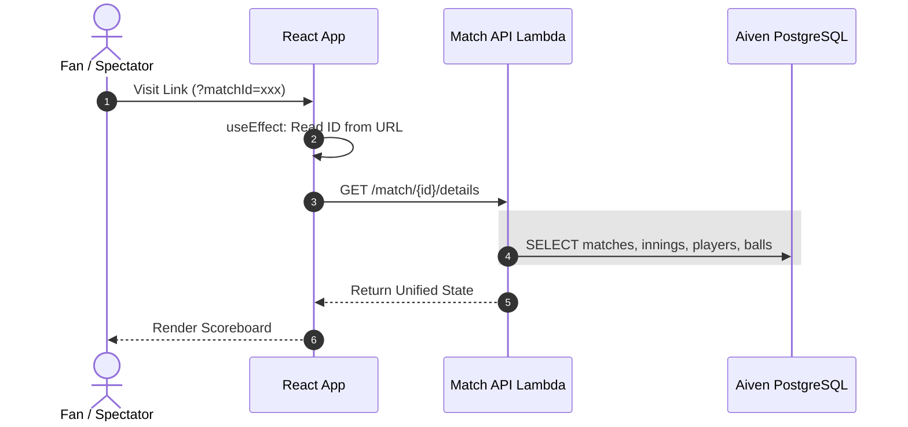
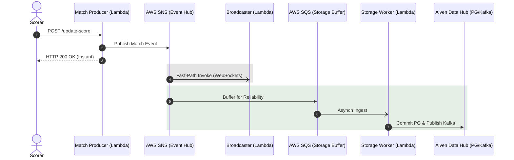
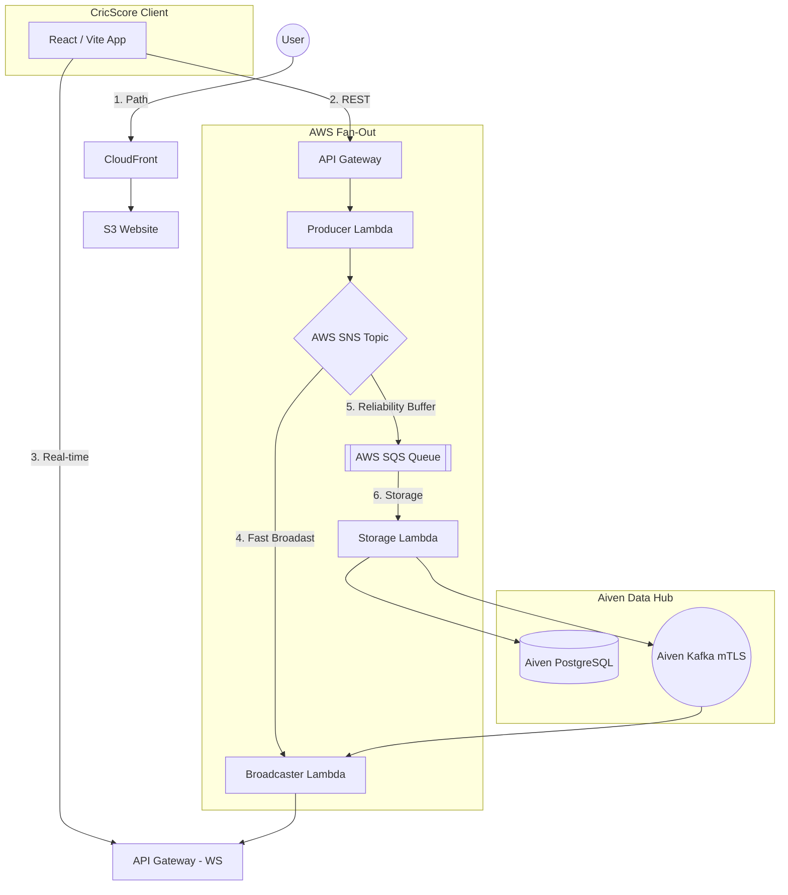

# 🏗️ Architecture: Live Event-Driven Scoring Engine

CricScore is built on a high-concurrency, **Event-Driven Architecture (EDA)** where every ball event is a persistent record in **Aiven PostgreSQL** and a real-time broadcast via **Aiven Kafka**.

---

## 🔄 Detailed Sequence Flows (v2.0 Fan-Out)

### 1. 📊 Fetch Match Details (Deep-Link Hydration)

### 2. ⚡ Live Score Update (Decoupled Fan-Out)

## 🔄 System Overview & Infrastructure Journey (v2.0)

---

## 🏛️ Technical Pillars & Specifications
CricScore implements a high-performance **Event-Driven Architecture (EDA)** using 100% serverless and managed services:

- **Decoupled Fan-Out (v2.0):** Leverages AWS SNS for instant UI responses and AWS SQS for asynchronous background persistence to Aiven PostgreSQL and Kafka.
- **mTLS Security:** Hardened, certificate-based encryption for all Kafka traffic using serverless certificate injection.
- **Zero-Latency Broadcast:** Achieves sub-100ms global score delivery using an asynchronous broadcaster lambda driven instantly by SNS.
- **State Restoration (v2.0):** Automated deep-link hydration for instant bypass-routing to active match scoreboards via UUID-anchored URLs.
- **Secure Isolation:** Enterprise-grade multi-tenant scoring engine with **VITE_ADMIN_PIN** record governance.

---

## 🏛️ Component Breakdown

### **1. Official Scorer (The Implementation)**
*   **Match Registry**: Games are anchored to a unique, non-sequentially generated UUID provided by the **Aiven PostgreSQL** registry during initialization.
*   **State Persistence**: ACID-compliant transactions ensure that innings, scores, and historical ball records are atomically committed.
*   **Administrative Archival**: AWS SES is integrated to provide official match-day record logging, delivering board-verified score summaries to the administrator for historical auditing.

### **2. Managed Fan Hub (The Discovery Engine)**
*   **Discovery Gateway**: Fan clients browse active games via a real-time match hub fetching from the Aiven repository.
*   **WebSocket Hub**: Sub-second socket propagation via **AWS WebSocket Gateway** with the connection registry managed in **DynamoDB**.
*   **Deep-Link System**: Zero-friction URL-restoration logic for immediate spectator bypass-routing (v1.5.2).

### 3. **Security Strategy**
- **Administrative Sovereignty**: Operations impacting global match state (e.g., `DELETE /match/{id}`) are restricted via a **State-Sync PIN** (`VITE_ADMIN_PIN`), ensuring only authorized board-governance actors can purge records.
- **Mutual TLS (mTLS)**: Hardened, certificate-based connections for all Kafka event traffic.
- **SSL Enforcement**: Mandatory for all Aiven PostgreSQL persistence sessions.
- **Multi-Tenant Isolation**: Dual-scoped session logic ensures that scorer identities and match states are isolated by both Email and MatchID, preventing cross-tenant data leakage.
- **Role-Based Access Hierarchy**:
    - **Viewer 🌍**: Public/No-Auth spectator access based solely on the sharable match UUID.
    - **Scorer 🎮**: Secure/Email-Auth access for persistence and ball-by-ball updates.
    - **Admin ⚡**: Protected/PIN-Auth access for global record purging and database maintenance.

---
© 2026 CricScore Documentation. 🏎️🏎️🏆🏛️🛡️🏁🚀
