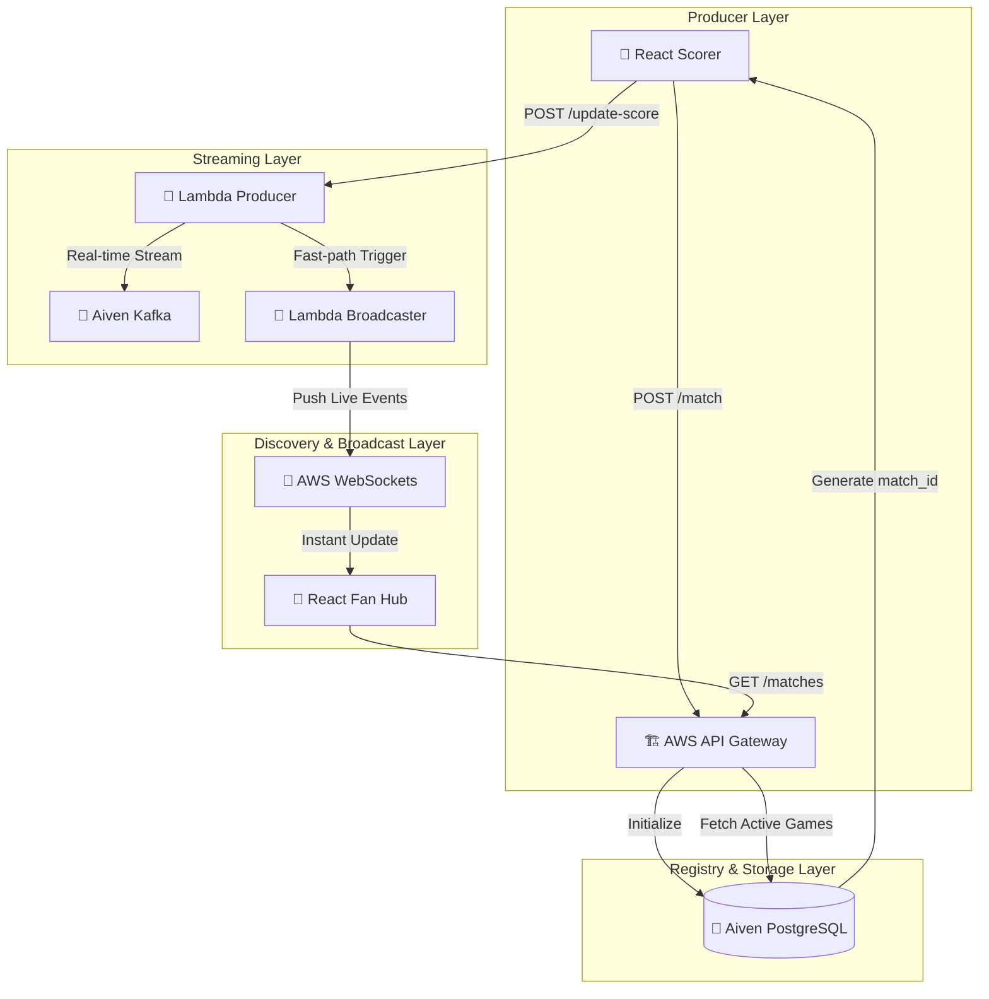

# 🏗️ Architecture: Live Event-Driven Scoring Engine

# 🏛️ CricScore System Architecture

Our application is built on a high-concurrency, **Event-Driven Architecture (EDA)** where every ball event is a persistent record in **Aiven PostgreSQL** and a real-time broadcast via **Aiven Kafka**.

## 🔄 The E2E Live Match Flow

## 🏟️ Component Breakdown

### **1. Official Scorer (The Producer)**
*   **Mode**: Administrative interface for match recording.
*   **Sync Strategy**: Dual-write. Every ball is persisted to **Aiven PG** for history and pushed to **Aiven Kafka** for propagation.
*   **Unique Identity**: Every game is anchored to a unique UUID generated by PostgreSQL during the `/match` initialization phase.

### **2. Aiven Managed Services (The Core)**
*   **PostgreSQL**: Serves as the **Match Registry** and historical record store.
*   **Apache Kafka**: The low-latency backend for ball-by-ball events. Secured with **mTLS (Mutual TLS)** to ensure only authorized producers can broadcast.

### **3. The Live Fan Hub (Discovery & Consumer)**
*   **Match Directory**: Fans can browse all active games via the `/matches` discovery hub.
*   **WebSocket Tunnel**: Sub-second score delivery using AWS WebSocket API Gateway.
*   **Dynamic Subscriptions**: Fans follow specific matches based on the `matchId`, enabling multi-game management at scale.

---

## ⚡ Components Summary

| Component | Responsibility | Tech Stack |
|---|---|---|
| **Scorer API** | Ingests and validates score updates. | AWS Lambda + Node.js 18.x |
| **Historical Data** | Persistent record of matches, innings, and balls. | Aiven for PostgreSQL |
| **Event Stream** | High-throughput backbone for all ball events. | Aiven for Apache Kafka |
| **Broadcaster** | Decoupled function that manages live distribution. | AWS Lambda (Fast-Path Trigger) |
| **State Layer** | Tracks active WebSocket connection IDs. | AWS DynamoDB |
| **Live Gate** | Bi-directional tunnel for mobile/web users. | AWS WebSocket API Gateway |
| **Persistence Cache** | Isolated per-user match state for resumption. | LocalStorage (Email-Scoped) |
| **Live Innings Cache**| Isolated ball-by-ball cache per-match. | LocalStorage (Match-Id Scoped) |

---

## 🏛️ Persistence & Isolation (v1.3.0)

To support multiple scorers on shared devices (tablets/laptops), CricScore v1.3.0 implements a **Dual-Scoped Isolation Layer**:

1.  **Email-Scoped Resumption**: The primary match metadata is stored in LocalStorage using the key `cric-match-state-{email_address}`. This allows Scorers to logout and return to their specific match without seeing other users' data.
2.  **Match-Scoped Live Caching**: Ball-by-ball scoring state is stored using `cric-live-match-{matchId}`. This ensures that starting a new match (Fresh ID) will never pull in "ghost" data from a previous session on the same account.
3.  **Cloud-Check Verification**: On every sync or login, the client performs an **Existence Heartbeat** against the backend. If a match is deleted by an Admin (404), the client forcibly purges its local cache to maintain a single source of truth.

---

## 🛡️ Security Strategy
- **Mutual TLS (mTLS)**: Used for all traffic between AWS Lambda and Aiven Kafka.
- **SSL Enforcement**: Required for all Aiven PostgreSQL sessions.
- **IAM Policies**: Least-privilege roles for all compute units.

---

## 🚀 Viral Sharing & Deep-Link System (v1.5.2)
CricScore v1.5.2 implements a **Zero-Friction Sharing Architecture** to maximize viral match-day growth and spectator onboarding:

1.  **Instant Sharable Links 🔗**: Every match is uniquely identified by a UUID generated by **Aiven PostgreSQL**. At match completion, the Scorer clones this ID into a high-punch sharing URL (`?matchId=xxx`).
2.  **Deep-Link Restoration**: Spectators clicking the link are bypass-routed by the **React Routing Hub**. The application detects the `matchId` on mount, delegating an automatic, high-performance fetch to the Metadata API.
3.  **Friction-Free Scoreboards**: This pivot removes the requirement for AWS SES Sandbox verification of spectator emails. Fans can instantly access ball-by-ball history without creating accounts or verifying addresses.
4.  **Administrative Logging**: AWS SES is retained solely for **Admin-Backend Logging**, sending official match records to a verified administrator endpoint for archival and audit purposes.

