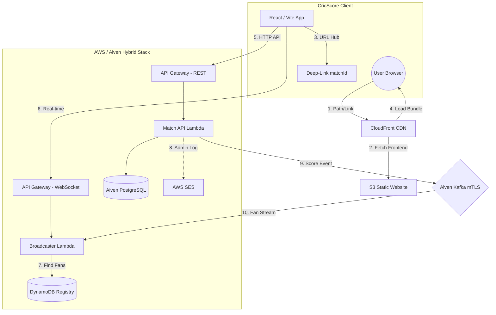
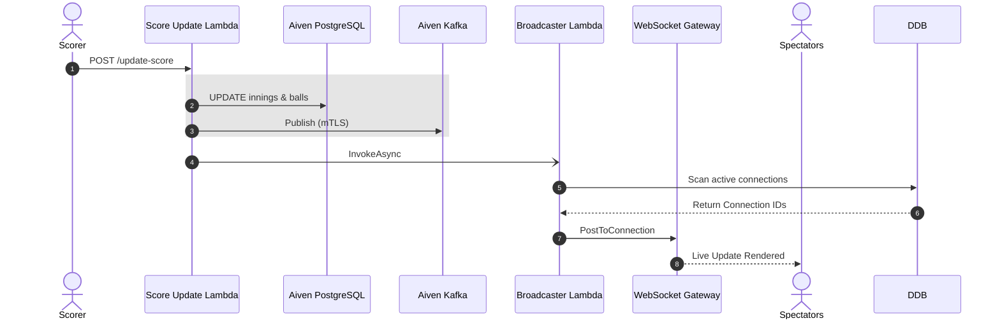
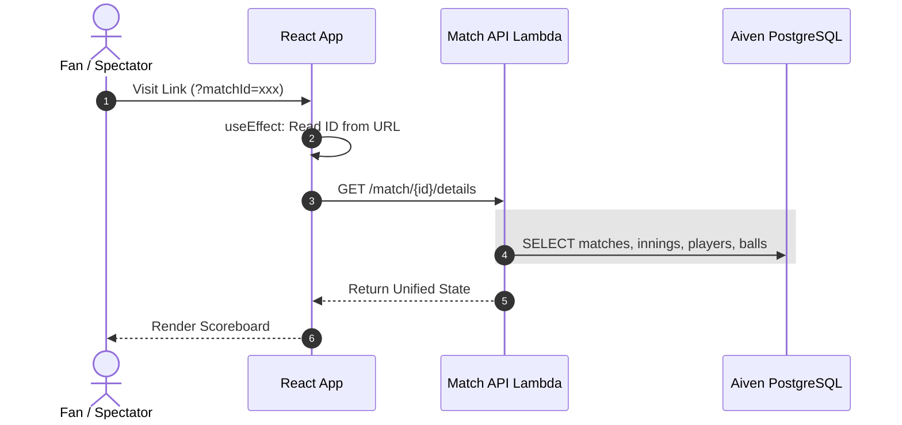

# 🏗️ Architecture: Live Event-Driven Scoring Engine

CricScore is built on a high-concurrency, **Event-Driven Architecture (EDA)** where every ball event is a persistent record in **Aiven PostgreSQL** and a real-time broadcast via **Aiven Kafka**.

## 🔄 System Overview & Infrastructure Journey

---

## 🏛️ Component Breakdown

### **1. Official Scorer (The Producer)**
*   **Dual-Write Strategy**: Every ball is persisted to **Aiven PG** for history and simultaneously pushed to **Aiven Kafka** for real-time propagation.
*   **Unique Identity**: Games are anchored to a unique UUID generated by PostgreSQL during the initialization phase.

### **2. Aiven Managed Services (The Core)**
*   **PostgreSQL**: Serves as the **Match Registry** and historical record store.
*   **Apache Kafka**: The low-latency backbone secured with **mTLS (Mutual TLS)** to ensure only authorized producers can broadcast.

### **3. The Live Fan Hub (Discovery & Consumer)**
*   **Match Directory**: Fans browse active games via the `/matches` discovery hub.
*   **WebSocket Tunnel**: Sub-second score delivery via AWS WebSocket API Gateway.
*   **Deep-Link Restoration (v1.5.2)**: Spectators reaching the hub via sharable links (`?matchId=xxx`) are automatically bypass-routed to the specific match scoreboard.

---

## 🚀 Viral Sharing & Deep-Link System (v1.5.2)
CricScore implements a **Zero-Friction Sharing Architecture** to maximize viral match-day growth:

1.  **Instant Sharable Links 🔗**: At match completion, a unique sharing URL is generated. Spectators clicking the link are instantly routed by the **React Routing Hub**.
2.  **Friction-Free Scoreboards**: Removes the requirement for SES email verification for spectators. Access is based solely on the match UUID.
3.  **Administrative Logging**: AWS SES is retained solely for **Admin-Backend Logging**, sending official records to a verified administrator for archival.

---

## 🔄 Detailed Sequence Flows

### 1. ⚡ Live Score Update (Dual-Write)

### 2. 📊 Fetch Match Details (Deep-Link Hydration)

### 3. 🛡️ Security Strategy
- **Mutual TLS (mTLS)**: Hardened connections for all Kafka traffic.
- **SSL Enforcement**: Mandatory for all Aiven PostgreSQL sessions.
- **Persistence Isolation**: Dual-scoped caching (Email + MatchId) prevents data leakage between concurrent sessions on the same device.

---
© 2026 CricScore Documentation. 🏎️🏎️🏆🏛️🛡️🏁🚀
