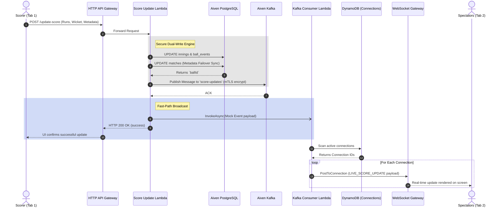
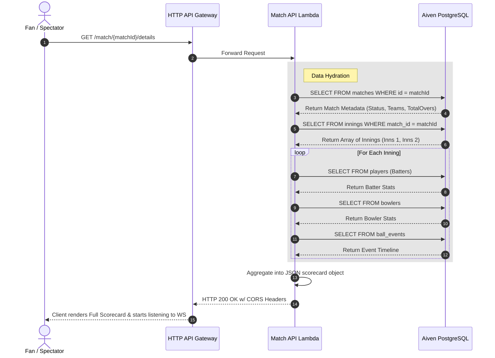
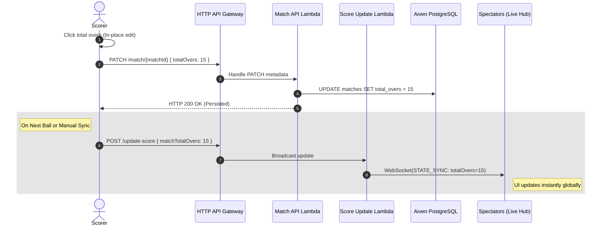
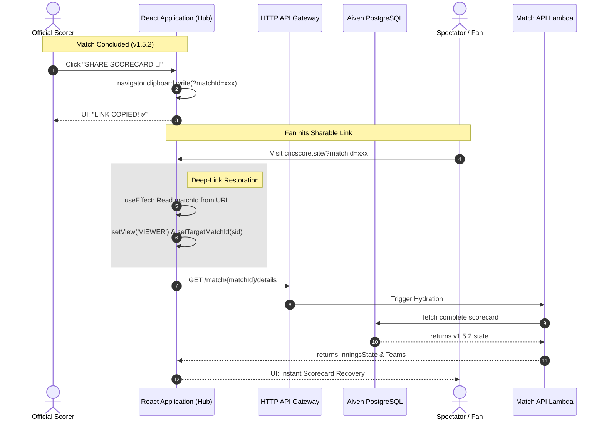

# 🏗️ CricScore Detailed Sequence Flows

Below are the detailed sequence flow diagrams illustrating the end-to-end technical processes for live scoring, data hydration, and automated reporting.

For a high-level overview of the web traffic journey, see the [main README](../README.md#🌐-web-traffic--infrastructure-journey).

---

## 1. ⚡ Live Score Update (Dual-Write & Broadcast) Flow
This architecture details the `POST /update-score` flow initiated when a Scorer records a run. It uses an asynchronous fast-path to overcome external Kafka connector delays, streaming updates to fans globally with sub-second latency.

---

## 2. 📊 Fetch Match Details (Historical/Initial Load) Flow
This architecture details the `GET /match/{matchId}/details` flow used when a completely new Spectator opens a match, or someone wants to view the final scorecard from the discovery hub.

---

## 3. ⚙️ Match Duration (Overs) Synchronization
This architecture details the specific flow for real-time match length adjustments (e.g. reducing a 20-over game to 15 overs due to time constraints).

---

## 4. 🏁 Viral Sharing & Deep-Link Restoration (v1.5.2)
This architecture details the zero-friction sharing flow. It replaces legacy email-verification hurdles with a viral, Match-ID based deep-linking system powered by **Aiven PostgreSQL** for instant spectator onboarding.

